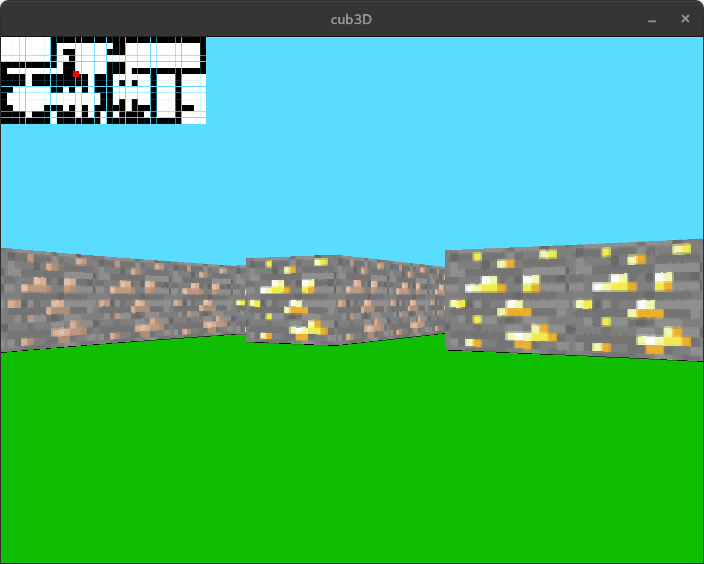
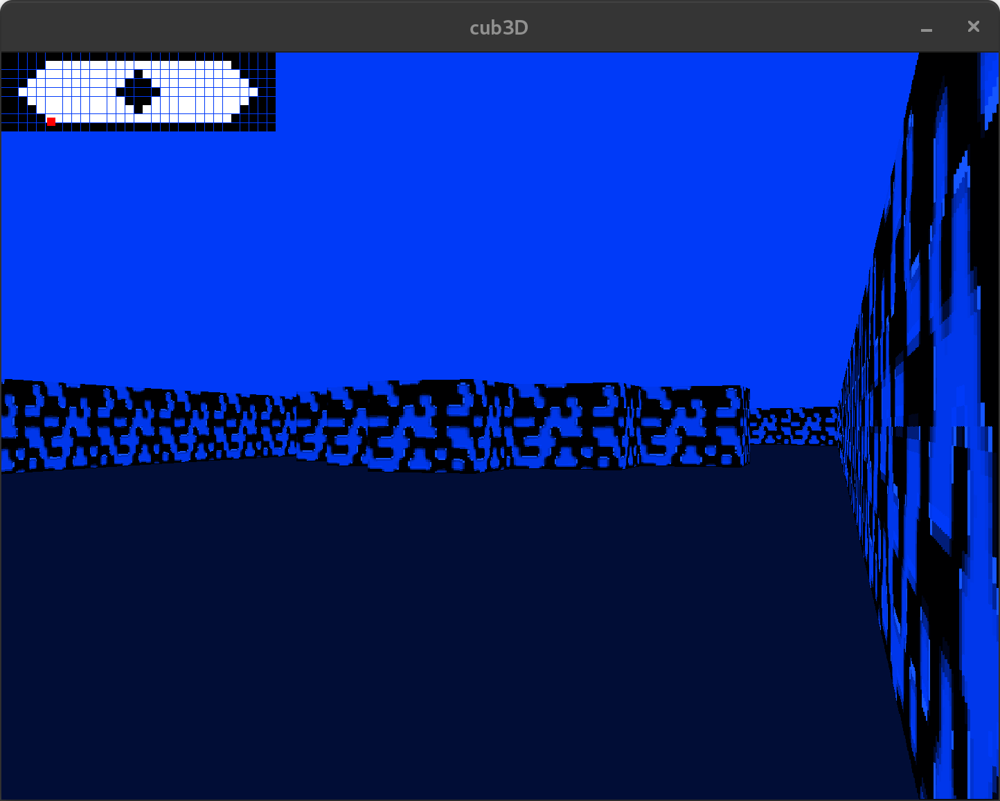

# cub3D

A simple raycasting engine inspired by Wolfenstein 3D, built for the 42 curriculum.

Status:
- Mandatory part: completed
- Bonus: wall collision and minimap implemented

## Features
- Raycasting-based rendering
- Textured walls
- Parsing `.cub` map files (textures, colors, map layout, player spawn)
- Robust wall collision
- Minimap overlay (with player position and field of view)

## Requirements
- GNU Make
- gcc or clang
- MinilibX (Linux variant)
- Standard C library and math library
- Linux: X11 and related dev packages (`libx11-dev`, `libxext-dev`, `libbsd-dev` may be needed depending on your distro)

## Setup

1) Clone the repository:
```bash
git clone https://github.com/Kragline/cub3D.git
cd cub3D
```

2) Clone and build MinilibX (Linux):
```bash
git clone https://github.com/42Paris/minilibx-linux.git
```

3) Build cub3D:
```bash
make
```

If your setup needs custom include/library paths for MinilibX, adjust your `Makefile` variables accordingly (e.g., `MLX_DIR`, `MLX_FLAGS`, `INCLUDES`, `LDFLAGS`).

## Usage

Run the program with a `.cub` map file:
```bash
./cub3D path/to/map.cub
```

Common `.cub` file structure includes:
- Texture paths for each wall orientation (NO, SO, WE, EA)
- Floor and ceiling colors (F, C)
- A rectangular map using `1` for walls, `0` for empty space, and a spawn character (`N`, `S`, `E`, `W`) for player orientation.

Example:
```text
NO ./textures/north.xpm
SO ./textures/south.xpm
WE ./textures/west.xpm
EA ./textures/east.xpm
F 220,100,0
C 255,255,255

1111111111111
1000000000001
1011110111101
10N0000100001
1111111111111
```

### Controls
- Move: W, A, S, D
- Rotate: Left/Right Arrow
- Exit: ESC
- Minimap: always visible (bonus)

## Screenshots


